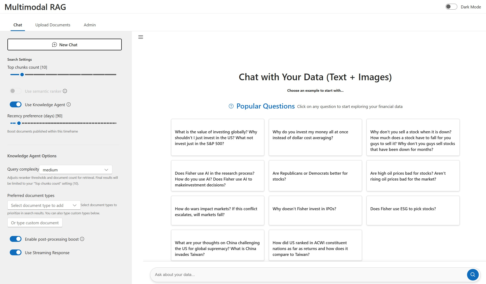
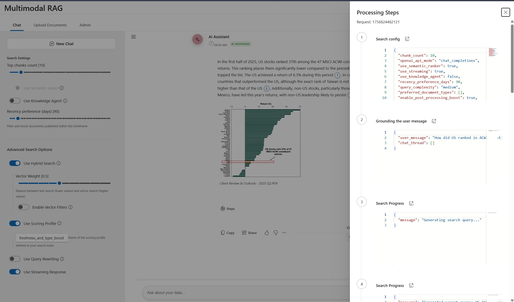
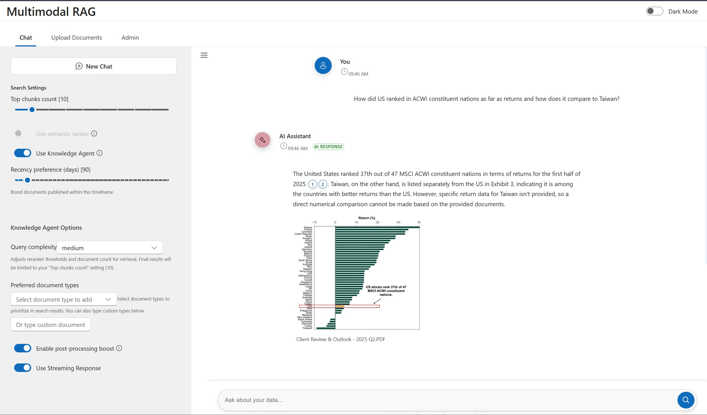
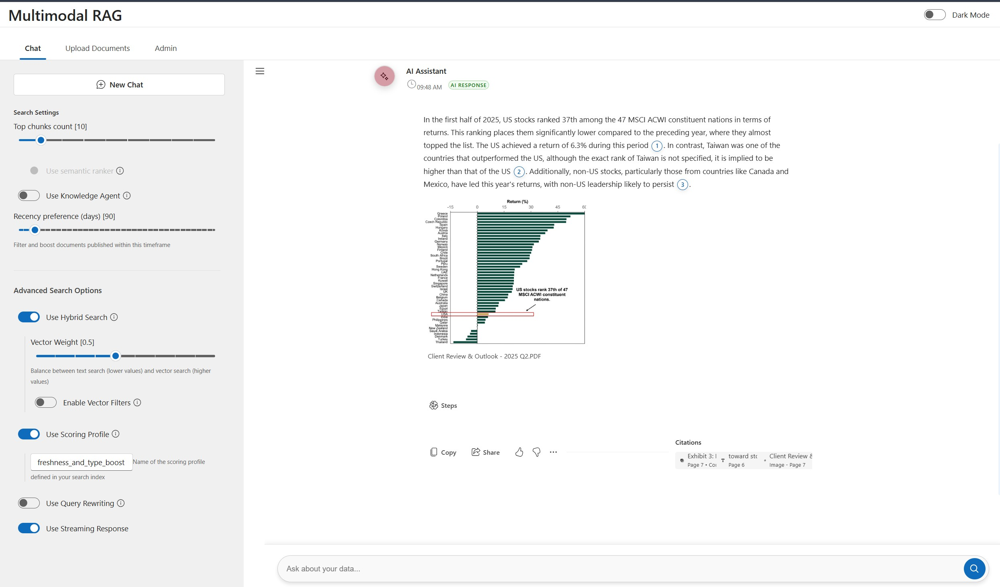
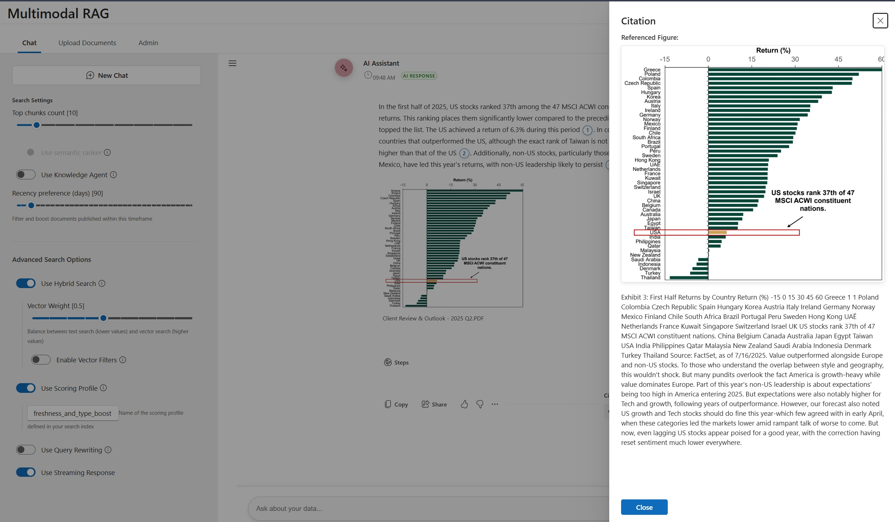
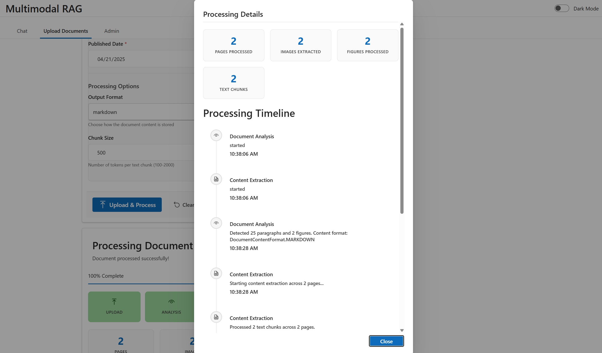

# Azure AI Search Multimodal RAG Demo
[](https://github.com/codespaces/new?hide_repo_select=true&ref=main&repo=984945158&skip_quickstart=true)

## Table of Contents

- [Azure AI Search Multimodal RAG Demo](#azure-ai-search-multimodal-rag-demo)
- [Azure AI Search Portal: Bring your own index and resources](#azure-ai-search-portal-bring-your-own-index-and-resources)
- [Getting Started](#getting-started)
   - [Local Development Quick Start](#local-development-quick-start)
   - [General Requirements](#general-requirements)
- [Environment setup](#environment-setup)
   - [Github codespaces](#github-codespaces)
   - [Local development setup (Windows or Linux)](#local-development-setup-windows-or-linux)
   - [Provision resources and deploy working app](#provision-resources-and-deploy-working-app)
   - [Generate .env file for existing deployments](#generate-env-file-for-existing-deployments)
   - [Debug app locally](#debug-app-locally)
   - [Bring your own data (supports .pdf only)](#bring-your-own-data-supports-pdf-only)
- [Azure Services Used for Deployment](#azure-services-used-for-deployment)
   - [Role Mapping for the Application](#role-mapping-for-the-application)
- [End-to-end app diagram](#end-to-end-app-diagram)
- [Troubleshooting](#troubleshooting)


Welcome to the **Azure AI Search Multimodal RAG Demo**. This repository contains the code for an application designed to showcase [multimodal](https://aka.ms/azs-multimodal) [Retrieval-Augmented Generation (RAG)](https://learn.microsoft.com/azure/search/retrieval-augmented-generation-overview) techniques using [Azure AI Search](https://learn.microsoft.com/azure/search/search-what-is-azure-search). This demo combines AI capabilities to create custom copilots / RAG applications that can query, retrieve, and reason over both text and image data.

With multimodal RAG, you can:

+ Extract relevant information from documents, screenshots, and visuals (like diagrams, charts, workflows, etc.).
+ Preserve and understand the relationships between entities in complex images to enable reasoning over structured content.
+ Generate grounded, accurate responses using Large Language Models (LLMs), integrating insights from both textual and visual modalities.

This demo is intentionally kept lean and simple, providing a hands-on experience with multimodal AI techniques. While not intended for production use, it serves as a powerful starting point for exploring how multimodal RAG can unlock new possibilities in building smarter, more context-aware applications.

Note that currently this sample doesn't have support for table extraction as a structure, but tables are extracted as plain text.

 
**Text citations**  
**Image citations**  

## Application Features

### Document Upload and Processing
The application includes a comprehensive document upload system that allows users to easily add new documents to the knowledge base. The upload feature supports PDF documents and automatically processes them through the multimodal pipeline.


*Document upload interface with drag-and-drop support*


*Real-time upload progress with processing status*


*Advanced upload settings including document type classification*


*Support for multiple document uploads with individual progress tracking*


*Upload completion with indexing status and success confirmation*

**Key Upload Features:**
- **Drag-and-drop interface**: Simple file upload with visual feedback
- **Real-time progress tracking**: Monitor upload and processing status
- **Document type classification**: Automatic categorization (quarterly reports, newsletters, articles, etc.)
- **Batch processing**: Upload multiple documents simultaneously
- **Automatic indexing**: Documents are automatically processed and added to the search index
- **Error handling**: Clear feedback on upload failures with retry options

### Admin Management Console
The application provides a powerful admin interface for managing the search index, monitoring system health, and performing administrative tasks.


*Admin dashboard with system overview and management options*


*Advanced admin tools for index management and system configuration*

**Key Admin Features:**
- **Index Management**: View, update, and manage search index configurations
- **Document Management**: Browse, edit, and delete indexed documents
- **System Monitoring**: Monitor application health, performance metrics, and usage statistics
- **Search Analytics**: Track search patterns, popular queries, and result quality
- **Configuration Management**: Adjust search parameters, semantic ranker settings, and hybrid search options
- **User Management**: Monitor user activity and access patterns
- **Bulk Operations**: Perform batch operations on documents and index data
- **System Maintenance**: Clear caches, rebuild indexes, and perform system optimization

Both the upload and admin features are designed with user experience in mind, providing intuitive interfaces for both end-users and administrators to effectively manage and interact with the multimodal RAG system. 

## Azure AI Search Portal: Bring your own index and resources
You can create an index using the AI Search portal's quick wizard for the multimodal scenario. Once the index is successfully created, you can integrate it with the app by running the following steps:

- Checkout a [code space](#azure-ai-search-multimodal-rag-demo) based on **main** branch
- Run ```az login --use-device-code```
- Run 
   ```pwsh
   scripts/portal-2-app.ps1 `
        -SearchIndexName "my-index" `
        -SearchServiceEndpoint "https://myservice.search.windows.net" `
        -StorageAccountUrl "https://myaccount.blob.core.windows.net" `
        -KnowledgeStoreContainerName "knowledgestore-artifacts" `
        -DataSourcesContainerName "data-sources" `
        -AzureOpenAiEndpoint "https://myopenai.openai.azure.com" `
        -AzureOpenAiDeploymentName "my-deployment" `
        -AzureOpenAiEndpointChatCompletionModelName "gpt-4o"
   ```

   Replace the placeholders (`<...>`) with your specific values. This script will configure the app to use the newly created index.  
   **Assumption**: For app simplicity, ensure 'KnowledgeStoreContainerName' and 'DataSourcesContainerName' must be from same storage account.
- Ensure your Azure Entra ID user object ID has been granted the necessary permissions for all required resources. See [Role Mapping for the Application](#role-mapping-for-the-application) for details.
- Run:
   ```bash
      src/start.sh
   ```

## Getting Started

### Local Development Quick Start

If you have already deployed the Azure resources and want to run the application locally for development:

#### Prerequisites (One-time Setup)
1. **Python Environment Setup**:
   - Install [Python 3.12.7](https://www.python.org/downloads/release/python-3127/)
   - Navigate to `src/backend` directory
   - Install dependencies: `pip install -r requirements.txt`

2. **Frontend Setup**:
   - Install [Node.js > v.18](https://nodejs.org/)
   - Navigate to `src/frontend` directory
   - Install dependencies: `npm install`

3. **Environment Configuration**:
   - **Option A (Automatic)**: If you deployed using `azd up`, your `.env` file was automatically created
   - **Option B (Manual)**: Run the setup script to generate `.env`:
     - Windows: `scripts/setup-local-env.ps1 -EnvironmentName <YOUR_ENV_NAME>`
     - Linux/macOS: `./scripts/setup-local-env.sh --environment <YOUR_ENV_NAME>`
   - **Option C (Manual)**: Copy `src/backend/.env.template` to `src/backend/.env` and populate manually

#### Running the Application Locally
Once the one-time setup is complete, follow these steps to run the application:

1. **Start the Backend Server**:
   - Open a terminal in the `src/backend` directory
   - Run: `start.bat` (this starts the Python backend server)

2. **Start the Frontend Development Server**:
   - Open a second terminal in the `src/frontend` directory  
   - Run: `npm run dev` (this starts the Vite development server)

3. **Access the Application**:
   - Frontend will be available at the URL shown in the terminal (typically `http://localhost:5173`)
   - Backend API will be running on `http://localhost:5000`

> **Note**: Make sure your `.env` file is properly configured with all Azure service endpoints and credentials before starting the servers.

### General Requirements  
To deploy and run this application, you will need the following:  
  
1. **Azure Account**  
   - If you're new to Azure, you can [sign up for a free Azure account](https://azure.microsoft.com/free) and receive some free credits to get started.   
   - Follow the guide to deploy using the free trial if applicable.  
  
2. **Azure Account Permissions**  
   - Your Azure account must have sufficient permissions to perform deployments. Specifically, you need:  
     - `Microsoft.Authorization/roleAssignments/write` permissions, such as those granted by the **Role Based Access Control (RBAC) Administrator**, **User Access Administrator**, or **Owner** roles.  
     - **Subscription-level permissions**. Alternatively, if you don’t have subscription-level permissions, you must be granted RBAC access for an existing resource group where you’ll deploy the application.  
     - `Microsoft.Resources/deployments/write` permissions at the subscription level.  
  
3. **Local Deployment Environment (Optional)**  
   - If a local deployment of the application is required, ensure you have one of the following operating systems set up:  
     - **Windows OS**  
     - **Linux OS**  
---  

## Environment setup

### Github codespaces
- Checkout a [code space](#azure-ai-search-multimodal-rag-demo) based on **main** branch

### Local development setup (Windows or Linux)
Install the below tools
- [Python 3.12.7](https://www.python.org/downloads/release/python-3127/)
- [Node.js > v.18](https://nodejs.org/)
- [az cli latest](https://learn.microsoft.com/en-us/cli/azure/install-azure-cli-windows?pivots=winget)
- [azd latest](https://learn.microsoft.com/en-us/azure/developer/azure-developer-cli/install-azd?tabs=winget-windows%2Cbrew-mac%2Cscript-linux&pivots=os-windows)
- [Powershell 7 (Windows and Linux)](https://github.com/powershell/powershell)

### Provision resources and deploy working app
- Run below commands (One time setup per environment)
  - Run ```az login --use-device-code```
  - Run ```azd auth login```
  - Run ```azd env new <YOUR_ENVIRONMENT_NAME>```
  - Run ```azd env set AZURE_PRINCIPAL_ID  <USER_OBJECT_ID>``` (This needs to user's object ID from Azure Entra ID. Alternate you can use command from your local development box ```az ad signed-in-user show --query id -o tsv``` )
  - Run ```azd up```. This command will:
    - Provision the azure resources
    - Package the application
    - Ingest data into azure search index
    - Deploy the working app to webApp services
    - **Automatically generate a `.env` file** for local development with all necessary API keys and configuration
  - NOTE: You might encounter provisioning errors on cohere. Please visit troubleshooting section for more details.
  - Once deployment succeeds, you can use the app.

> **✨ New**: The deployment process now automatically creates a `.env` file in `src/backend/.env` with all the required configuration for local development, including API keys fetched from the deployed Azure services.


NOTE: It may take 5-10 minutes after you see 'SUCCESS' for the application to be fully deployed. If you see a "Python Developer" welcome screen or an error page, then wait a bit and refresh the page.

### Generate .env file for existing deployments
If you have an existing deployment and need to generate or update your local `.env` file:

**On Windows:**
```powershell
scripts/setup-local-env.ps1 -EnvironmentName <YOUR_ENVIRONMENT_NAME>
```

**On Linux/macOS:**
```bash
./scripts/setup-local-env.sh --environment <YOUR_ENVIRONMENT_NAME>
```

This script will:
- Fetch all necessary API keys from your deployed Azure services
- Generate a complete `.env` file with proper configuration
- Include all performance, security, and monitoring settings

> **📖 For detailed information** about the automated setup process, troubleshooting, and configuration options, see [Local Development Setup Guide](docs/local-development-setup.md).


### Debug app locally
- You need to ***provision all the resources*** before you start to debug app locally
- After running `azd up`, your `.env` file will be automatically created with all necessary configuration
- To launch the app locally, run the below command. The website will open automatically and be served at [localhost:5000](http://localhost:5000).

**On Windows:**
```powershell
src/start.ps1
```

**On Linux:**
```bash
src/start.sh
```

> **Note**: If you don't have a `.env` file or need to regenerate it, use the setup scripts mentioned in the [Generate .env file](#generate-env-file-for-existing-deployments) section above.

### Bring your own data (supports .pdf only)
- To index your own data,
   - Place pdf's under ```/data``` folder
   - Run ```scripts\prepdocs.ps1```
- You could also use different indexer strategies **["indexer-image-verbal", "self-multimodal-embedding"]**
- To create new index with a different strategy
  - Run ```azd set SEARCH_INDEX_NAME <new-index-name>```
  - **On Windows** Run ```scripts\prepdocs.ps1 -IndexerStrategy indexer-image-verbal ```
  - **On Linux** Run ```scripts\prepdocs.sh indexer-image-verbal ```
---

## Azure Services Used for Deployment  
The following Azure services are used as part of this deployment. Ensure you verify their billing and pricing details as part of the setup:  
  
1. **Azure AI Search**  
   - Service used for search functionalities within the application. Review [pricing](https://azure.microsoft.com/pricing/details/search/).
  
2. **Azure AI Document Intelligence**  
   - Service used for processing and extracting information from documents. Review [pricing](https://azure.microsoft.com/pricing/details/ai-document-intelligence/). 
  
3. Your provided:
   - **LLM Deployment**: For running the large language model (LLM) for verbalization and used by the RAG orchestrator. 
   - **Embedding Model Deployment**: Used for creating embeddings for vector search and other tasks.   
   - Ensure you check the pricing for both LLM and embedding deployments.
   - This sample currently supports gpt-4o, (AOAI) text-embedding-large, cohere-serverless-v3  
  
4. **Azure Blob Storage Account**  
   - Used to store extracted images and other data. Verify the pricing for storage and associated operations. Review [pricing](https://azure.microsoft.com/pricing/details/storage/blobs/).
  
5. **Azure App Service**  
   - Used to host and run the application in the cloud. Review [pricing](https://azure.microsoft.com/pricing/details/app-service/windows/). 

### Role Mapping for the Application  
The following table maps the roles used by the application to their respective functions:  
  
| **Role ID**                              | **Built-in Role Name**                  | **Purpose**                                                                                     |  
|------------------------------------------|------------------------------------------|-------------------------------------------------------------------------------------------------|  
| `5e0bd9bd-7b93-4f28-af87-19fc36ad61bd`   | **Cognitive Services OpenAI User**       | Read-only access to models, files, and deployments in an Azure OpenAI resource. Allows running completion/embedding/image-generation calls. |  
| `a97b65f3-24c7-4388-baec-2e87135dc908`   | **Cognitive Services User**              | Provides read access to an Azure Cognitive Services resource and the ability to list its access keys. (No write or manage permissions.) |  
| `ba92f5b4-2d11-453d-a403-e96b0029c9fe`   | **Storage Blob Data Contributor**        | Allows read, upload, modify, and delete operations on blobs and containers within an Azure Storage account (data-plane only). |  
| `7ca78c08-252a-4471-8644-bb5ff32d4ba0`   | **Search Service Contributor**           | Enables management of the Azure Cognitive Search service (e.g., create, scale, delete). Does not provide access to index data itself. |  
| `8ebe5a00-799e-43f5-93ac-243d3dce84a7`   | **Search Index Data Contributor**        | Provides full create, read, update, and delete access to all
| `64702f94-c441-49e6-a78b-ef80e0188fee`   | **Azure AI Developer**                   | Provides full create, read access to AI foundry projects.

## End-to-end app diagram


## Troubleshooting
- What is the region availability for Azure OpenAI service?  
  Please visit [available regions](https://learn.microsoft.com/azure/ai-services/openai/concepts/models?tabs=global-standard%2Cstandard-chat-completions#global-standard-model-availability)
- What is the region availability for Cohere Serverless?    
  Cohere serverless is supported only in [5 regions](https://learn.microsoft.com/azure/ai-foundry/how-to/deploy-models-serverless-availability#cohere-models)
- Deployment fails for 'Cohere' in marketplace subscription 
  - Ensure your subscription is supported or enabled for Marketplace deployment [Learn more](https://learn.microsoft.com/en-us/azure/ai-foundry/how-to/deploy-models-serverless?tabs=azure-ai-studio#prerequisites)
  - There is a known issue of conflict operation between Marketplace subscription and endpoint deployment. **Rerun deployment** to fix it
 
## Local Authentication & Managed Identity

This project supports two AAD-based authentication modes when running locally or in Azure: API key based auth (API_KEY) and AAD-based auth (managed_identity in the app). Note: in this repo "managed_identity" means "use AAD-based auth" — this can be a managed identity in Azure or any service principal (client id/secret) provided through environment variables.

Summary:
- DefaultAzureCredential (the library used by the app) will try multiple credential sources in order. Common sources include: Environment (client id / secret), Managed Identity, Visual Studio/VS Code cache, Azure CLI (your user). If the Environment variables AZURE_CLIENT_ID / AZURE_CLIENT_SECRET / AZURE_TENANT_ID exist in the process environment, EnvironmentCredential will be used first.
- The project loads `src/backend/.env` early during startup (see `core/config.py`), so values in that file are placed into process environment variables for local runs.

If you want to run the app locally as your user (Azure CLI credential) instead of using the service principal in `.env`

1) Option A — Temporarily unset the SPN env vars in your session and run the app (PowerShell):

```powershell
Remove-Item Env:AZURE_CLIENT_ID -ErrorAction SilentlyContinue
Remove-Item Env:AZURE_CLIENT_SECRET -ErrorAction SilentlyContinue
Remove-Item Env:AZURE_TENANT_ID -ErrorAction SilentlyContinue
az login
# run the app in the same shell
python .\src\backend\app.py
```

2) Option B — Change the credential used for local debugging (code change)
- Use the Azure CLI credential explicitly while developing:

```python
from azure.identity import AzureCliCredential
credential = AzureCliCredential()
```

- Or keep DefaultAzureCredential but exclude environment credentials so it falls back to the CLI cached user:

```python
from azure.identity import DefaultAzureCredential
credential = DefaultAzureCredential(exclude_environment_credential=True)
```

Where to change: the factory that builds credentials is `src/backend/core/azure_client_factory.py`. You can make the change locally for development and revert before deployment.

If you intend to use the service principal defined in `src/backend/.env` (the SPN client id / secret), you must grant RBAC roles to that SPN — granting roles to your user account will not affect tokens issued for the SPN.

Example: how to find the SPN object id (PowerShell / az CLI)

```powershell
#$clientId from .env (example):
#$clientId = "fb3c0e70-f3bb-46a1-9f0b-2587b49a3d0c"
az ad sp show --id $clientId --query id -o tsv
```

Recommended minimal RBAC roles (grant on each resource, scope to resource where possible):
- Storage (read documents/images): Storage Blob Data Reader
- Cognitive Search (query/index read): Search Index Data Reader (or Search Data Reader if available)
- Azure OpenAI / Cognitive Services (run model/embedding calls): Cognitive Services OpenAI User

Example role assignment commands (PowerShell friendly). Replace placeholders with your values:

```powershell
#$objectId = $(az ad sp show --id <clientId> --query objectId -o tsv)
#$storageId = "/subscriptions/<sub>/resourceGroups/<rg>/providers/Microsoft.Storage/storageAccounts/<storage-name>"
#$searchId  = "/subscriptions/<sub>/resourceGroups/<rg>/providers/Microsoft.Search/searchServices/<search-name>"
#$openaiId  = "/subscriptions/<sub>/resourceGroups/<rg>/providers/Microsoft.CognitiveServices/accounts/<openai-name>"

az role assignment create --assignee-object-id $objectId --role "Storage Blob Data Reader" --scope $storageId
az role assignment create --assignee-object-id $objectId --role "Search Index Data Reader" --scope $searchId
az role assignment create --assignee-object-id $objectId --role "Cognitive Services OpenAI Contributor" --scope $openaiId
```

Quick verification
- Check role assignments for the object id:

```powershell
az role assignment list --assignee $objectId -o table
```

- Check Activity Log for the resource in the Azure portal to see any failed 403 authorization attempts — the log shows the principal and operation name that failed.

Token inspection (quick way to confirm which principal was used)

```python
from azure.identity import DefaultAzureCredential
import base64, json

cred = DefaultAzureCredential()
token = cred.get_token("https://management.azure.com/.default")
print("expires_on:", token.expires_on)
jwt = token.token
parts = jwt.split('.')
payload_b64 = parts[1] + '=' * (-len(parts[1]) % 4)
print(json.dumps(json.loads(base64.urlsafe_b64decode(payload_b64)), indent=2))
```

Look for claims like `appid` or `azp` (client id for SPN) or `upn` / `preferred_username` (user principal) or `oid` (object id). If the `appid` equals the client id in `.env`, EnvironmentCredential (the SPN) was used.

Async loop warning
- If you see warnings about "Future attached to a different loop" from `azure.identity.aio` on Windows/Python, it usually means async/sync code is mixing. Two mitigations:
   - Use the async clients and `azure.identity.aio.DefaultAzureCredential()` inside async code, or
   - Use sync clients and `azure.identity.DefaultAzureCredential()` consistently. The codebase already creates async clients in `core/azure_client_factory.py`; ensure you create the credential once and reuse it (the factory does this).

Example: what we ran in this repo (you can adapt these for your deployment)
- The `.env` in this repo contains a service principal client id `fb3c0e70-f3bb-46a1-9f0b-2587b49a3d0c` (do NOT check secrets into public repos).
- We resolved the service principal object id and assigned the three minimal roles on the sample resources in the repo (storage/search/AOAI). If you use your own resources, replace resource names and scopes.

If you want, we can add an optional startup flag to force Azure CLI credential in dev mode; tell me if you'd like that patch and I will prepare it.

---

